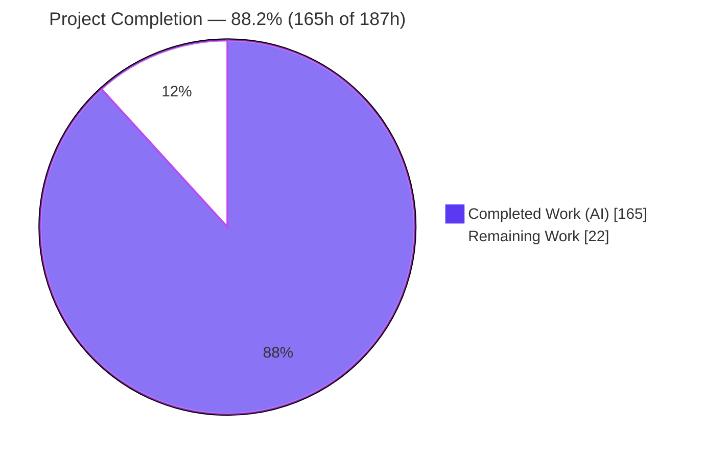
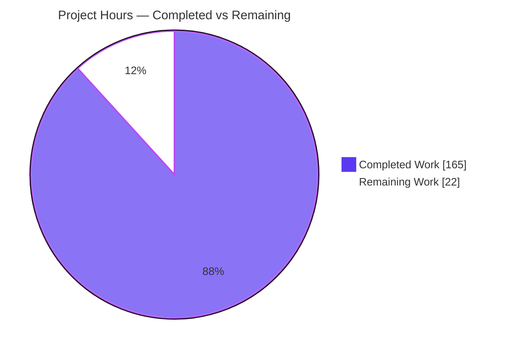
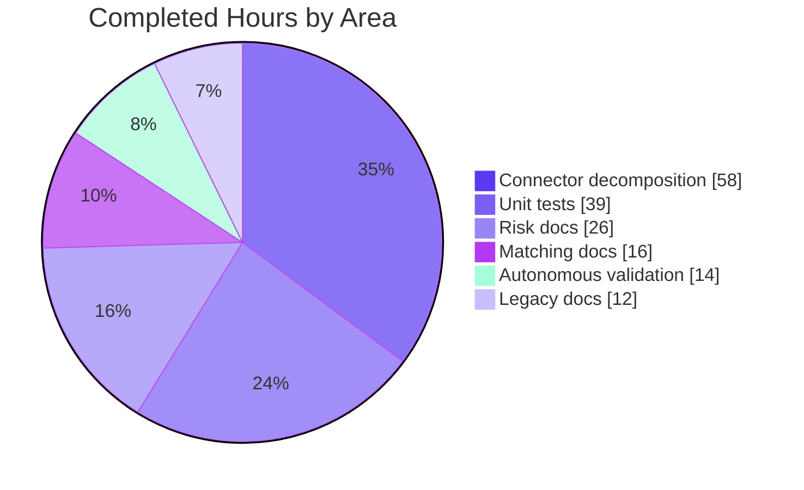
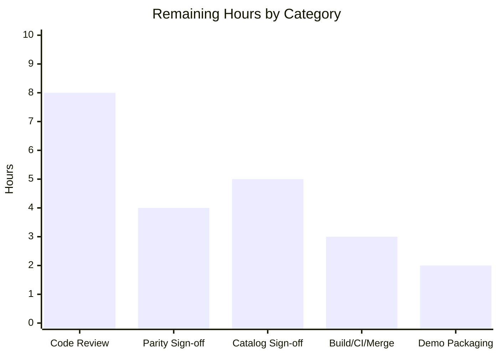

# Blitzy Project Guide — StockSharp Connector Decomposition & Business-Rule Documentation

> **Brand legend:** Completed / AI Work = Dark Blue **`#5B39F3`** · Remaining / Not Completed = White **`#FFFFFF`** · Headings / Accents = Violet-Black **`#B23AF2`** · Highlight = Mint **`#A8FDD9`**

---

## 1. Executive Summary

### 1.1 Project Overview

This project refactors the StockSharp C#/.NET trading-platform core along two axes without changing any observable behavior. First, it decomposes the oversized `Connector` "god object" (four partial files, ~4,252 lines) into three named, interface-backed components — subscription management, message processing, and event dispatch — composed behind a slim `Connector` façade that still implements `IConnector` exactly. Second, it makes the platform's implicit, code-only business rules explicit: the 16-rule pre-trade risk engine and the matching engine each receive inline XML documentation plus a plain-language markdown catalog, and all legacy/obsolete code is classified and annotated. Target users are StockSharp platform engineers and the sales-demo audience; the deliverable proves Blitzy can safely decompose god objects and reverse-engineer undocumented logic.

### 1.2 Completion Status

The completion percentage is computed strictly on AAP-scoped work plus path-to-production activities (PA1 methodology): **Completed Hours ÷ (Completed + Remaining) = 165 ÷ 187 = 88.2%**.



| Metric | Hours |
|--------|-------|
| **Total Hours** | **187** |
| Completed Hours (AI + Manual) | 165 |
| &nbsp;&nbsp;• AI (autonomous) | 165 |
| &nbsp;&nbsp;• Manual (human) | 0 |
| **Remaining Hours** | **22** |
| **Percent Complete** | **88.2%** |

> All completed hours are autonomous (Blitzy agents). The 22 remaining hours are human governance gates (review, sign-off, merge/release), not additional coding.

### 1.3 Key Accomplishments

- ✅ **`Connector` god object decomposed** — three new components (`ConnectorMessageProcessor`, `ConnectorEventDispatcher`, `ConnectorSubscriptionManager`) with three new segregated interfaces, wired from a slim façade via composition/delegation; `IConnector` surface unchanged.
- ✅ **Message-processing logic extracted** — `Connector_ProcessMessage.cs` shed 830 lines to the new component while the façade retains `OnProcessMessage` + the `switch (message.Type)` dispatch in identical order.
- ✅ **Event-firing logic extracted** — `Connector_Raise.cs` net −116 lines; public `IConnector` event declarations remain on the façade, firing delegated to `ConnectorEventDispatcher`.
- ✅ **Risk engine documented** — all 16 concrete rule classes + 7 infrastructure classes received XML docs; new `docs/risk-rules.md` (425 lines) plain-language catalog with the universal signed-threshold pattern and worked examples.
- ✅ **Matching engine documented** — 5 files XML-documented; new `docs/matching-engine-rules.md` (377 lines) covering order matching, margin/liquidation, stop-triggering, and in-memory bookkeeping.
- ✅ **Legacy code classified & annotated** — `MarketEmulatorOld.cs`, 12 `StrategyOld*.cs`, and `Security.Obsolete.cs` documented (what / why-legacy / superseded-by) with zero functional change.
- ✅ **New seam tests added** — 127 MSTest + Moq tests (52 + 50 + 25) covering the previously monolith-only seams; 100% pass, deterministic across 3 runs.
- ✅ **Behavior proven identical** — 49 behavioral-parity guards pass (MarketEmulatorOld V1 ↔ V2 message-by-message, Parity_Risk_*, Strategy equivalence); 0 compile errors; documentation-only diffs contain 0 non-comment added code lines.
- ✅ **Hard guardrails honored** — no database/SQL/ORM layer introduced; no package/dependency changes (0 manifest edits); namespaces preserved.

### 1.4 Critical Unresolved Issues

| Issue | Impact | Owner | ETA |
|-------|--------|-------|-----|
| Human peer review of decomposition not yet performed | Standard governance gate before merge; low technical risk (all automated gates pass) | Senior .NET Engineer | 1 day |
| Behavioral-parity human sign-off pending | Formal confirmation of "identical behavior" mandate | Lead / QA | 0.5 day |
| Reverse-engineered rule catalogs need business sign-off | Catalogs are the demo payload; wording must match business intent | Domain SME | 1 day |

> There are **no** code-level blockers: 0 compile errors, 0 in-scope test failures, 0 in-scope warnings. All items above are review/sign-off gates.

### 1.5 Access Issues

| System / Resource | Type of Access | Issue Description | Resolution Status | Owner |
|-------------------|----------------|-------------------|-------------------|-------|
| SQL Server (`SQLSERVER_CONNECTION_STRING`) | Integration-test DB | Absent by design — 11 export tests skip via `Assert.Inconclusive`. Providing it is **out of scope** (AAP no-DB guardrail) | Accepted (by design) | N/A |
| Sibling `../Connectors` repo (62 adapter projects) | Full-solution build input | Not present this session; full `StockSharp.slnx` (121 projects) not built | Recommended pre-release step (out of scope) | DevOps |

> No repository-permission or credential blockers affected the in-scope build. The two rows above are intentional scope boundaries, not access failures.

### 1.6 Recommended Next Steps

1. **[High]** Conduct senior code review of the `Connector` façade + 3 extracted components — verify `OnProcessMessage` dispatch order, `Connector_Raise` event sequence, and the dual In/Out threading boundary are preserved.
2. **[High]** Perform behavioral-parity verification & sign-off — review the 49 parity guards (optionally re-run locally) and confirm the "identical behavior" mandate.
3. **[Medium]** Obtain business/domain sign-off on `docs/risk-rules.md` and `docs/matching-engine-rules.md` against business intent.
4. **[Medium]** Run a full-solution build with the sibling `Connectors` present, confirm CI-on-PR is green (with flaky-test quarantine/retry), then merge and tag the release.
5. **[Low]** Package the sales-demo walkthrough using the clean reviewable diff and the reverse-engineered catalogs as proof points.

---

## 2. Project Hours Breakdown

### 2.1 Completed Work Detail

| Component | Hours | Description |
|-----------|-------|-------------|
| `IConnectorSubscriptionManager` extraction | 6 | Interface (149 L) extracted from existing public surface; `ConnectorSubscriptionManager` implements it (2-line change, byte-identical logic) |
| `ConnectorMessageProcessor` + interface | 22 | New component (859 L) + `IConnectorMessageProcessor` (164 L); hosts `Process*Message` logic, order-critical dispatch reproduced exactly |
| `ConnectorEventDispatcher` + interface | 14 | New component (430 L) + `IConnectorEventDispatcher` (340 L); event-firing logic extracted, declarations kept on façade |
| `Connector` façade slimming + wiring | 10 | 3 components held as `private readonly` segregated-interface fields, constructed via delegation (composition over inheritance) |
| Partial delegation + order verification | 6 | `Connector_ProcessMessage.cs` (−830 L) and `Connector_Raise.cs` (−116 net) delegate to components; dispatch/event order verified |
| Risk engine — 16 concrete rules XML docs | 12 | Exact trigger condition + action documented per rule (signed-threshold semantics, zero-disables) |
| Risk engine — 7 infrastructure classes XML docs | 4 | `IRiskManager`, `IRiskRule`, `IRiskRuleProvider`, `RiskActions`, `RiskManager`, `RiskMessageAdapter`, `RiskRule` |
| `docs/risk-rules.md` catalog | 10 | 425-line plain-language catalog: universal pattern, 3 actions, all 16 rules, worked examples |
| Matching engine — 5-file XML docs | 8 | `OrderMatcher`, `OrderBook`, `MarginController`, `StopOrderManager`, `EmulatedPortfolioManager` |
| `docs/matching-engine-rules.md` catalog | 8 | 377-line catalog: matching, margin/liquidation, stop-triggering, in-memory bookkeeping |
| Legacy — `MarketEmulatorOld.cs` header | 2 | Legacy classification: superseded by `MarketEmulator` V2, parity-guarded |
| Legacy — 12 `StrategyOld*.cs` files | 6 | Reinforced legacy docs; load-bearing for parity/equivalence suites |
| Legacy — `Security.Obsolete.cs` catalog | 4 | Obsolete-member → replacement catalog (e.g., `LocalTime` → `Level1ChangeMessage`) |
| Unit tests — `ConnectorMessageProcessorTests` (52) | 18 | 1,620 L; direct component tests, MSTest + Moq |
| Unit tests — `ConnectorEventDispatcherTests` (50) | 14 | 1,295 L; direct component tests |
| Unit tests — `SubscriptionManagerInterfaceTests` (25) | 7 | 569 L; interface-level coverage |
| Autonomous validation & review cycles | 14 | Code-review fixes (F1–F10), QA fixes (Q1–Q5, QA-10), restore/build/test, 49 parity guards |
| **Total Completed** | **165** | |

### 2.2 Remaining Work Detail

| Category | Hours | Priority |
|----------|-------|----------|
| Code review of façade + 3 components + delegation glue + IConnector API-surface diff | 8 | High |
| Behavioral-parity verification & sign-off (49 guards + V1↔V2 FullComparison) | 4 | High |
| Business/domain sign-off on risk & matching-engine catalogs | 5 | Medium |
| Full-solution build (with `Connectors`) + CI-on-PR green + merge + release tag | 3 | Medium |
| Sales-demo walkthrough packaging | 2 | Low |
| **Total Remaining** | **22** | |

> Priority split: **High = 12h**, **Medium = 8h**, **Low = 2h**. **2.1 (165) + 2.2 (22) = 187** total.

### 2.3 Confidence & Basis of Estimate

- **High confidence** on completed hours — grounded in git evidence (+8,165/−1,167 across 56 files), verified line counts, and the PRODUCTION-READY validator verdict.
- **Medium-High confidence** on remaining hours — standard governance/review gates for a behavior-preserving refactor of this size; no unknown coding work remains.

---

## 3. Test Results

All tests below originate from Blitzy's autonomous validation logs for this project (MSTest + Moq harness, `StockSharp_Tests.slnx`, Release).

| Test Category | Framework | Total Tests | Passed | Failed | Coverage % | Notes |
|---------------|-----------|-------------|--------|--------|-----------|-------|
| New Component — Message Processing | MSTest + Moq | 52 | 52 | 0 | N/R | `ConnectorMessageProcessorTests`; deterministic across 3 runs |
| New Component — Event Dispatch | MSTest + Moq | 50 | 50 | 0 | N/R | `ConnectorEventDispatcherTests`; deterministic across 3 runs |
| New Component — Subscription Mgr Interface | MSTest + Moq | 25 | 25 | 0 | N/R | `SubscriptionManagerInterfaceTests`; deterministic across 3 runs |
| **New In-Scope Subtotal** | MSTest + Moq | **127** | **127** | **0** | N/R | AAP seam-test deliverable — 100% pass |
| Behavioral-Parity Guards | MSTest | 49 | 49 | 0 | N/R | V1↔V2 `FullComparison_*`, `Parity_Risk_*`, Strategy equivalence (subset of full suite) |
| Full Regression Suite (Run A) | MSTest | 4,542 | 4,531 | 0 | N/R | 11 skipped (SQL export, by-design). Component & parity rows above are subsets of this suite |

**Notes on totals & overlap:** The 127 new-component tests and the 49 parity guards are **subsets** of the full 4,542-test suite, so rows are not additive. Run A recorded 0 failures; a second full run (Run B) showed exactly **1 intermittent failure** in the out-of-scope, unchanged `ConnectorRoutingTests.EdgeCase_NoSecurityMapping_FallbackToAll` (a pre-existing timing flake, ~67% flaky at **both** base and HEAD — not a regression). **Coverage %** is marked **N/R (not reported)** — line-coverage instrumentation was not part of the autonomous validation logs; correctness was proven via deterministic pass rates and behavioral-parity guards rather than a coverage number.

---

## 4. Runtime Validation & UI Verification

**UI Verification:** ❎ **Not applicable** — the in-scope deliverables are .NET class libraries. WPF UI, `Samples/`, and the end-user GUI apps (Designer / Hydra / Terminal / Shell) are explicitly out of scope; no user-facing screens were added or modified.

**Runtime health (exercised via the test harness):**

- ✅ **Compilation** — `dotnet build StockSharp_Tests.slnx -c Release` → exit 0, **0 errors**, 0 in-scope warnings (22 projects).
- ✅ **Dependency restore** — `dotnet restore` → exit 0, all 22 projects, 0 errors, 0 package changes.
- ✅ **Connector pipeline** — 184 connect/backtest/HistoryEmulation tests + 446 `Process*` handler tests run the full extracted pipeline.
- ✅ **Behavioral parity** — 49 guards pass (MarketEmulatorOld V1 vs MarketEmulator V2 message-by-message equality; risk & strategy equivalence) → identical behavior preserved.
- ✅ **Event ordering & threading boundary** — dual In/Out channel boundary and `OnProcessMessage` dispatch order validated via parity guards + 127 seam tests.
- ⚠ **Full-solution runtime (with `Connectors`)** — not exercised this session (out of scope); recommended as a pre-release step. `IConnector` contract unchanged → expected safe.
- ⚠ **CI flake watch** — one pre-existing out-of-scope timing flake can intermittently redden CI; mitigate with retry/quarantine.

---

## 5. Compliance & Quality Review

Cross-mapping of AAP deliverables and invariants to Blitzy quality benchmarks:

| AAP Deliverable / Invariant | Benchmark | Status | Evidence / Fixes Applied |
|-----------------------------|-----------|--------|--------------------------|
| Decompose `Connector` into interface-backed components | Structural refactor complete | ✅ Pass | 3 components + 3 interfaces in dedicated files; façade delegates |
| Preserve `IConnector` + provider contracts exactly | Backward compatibility | ✅ Pass | 0 compile errors; signatures unchanged; 22 projects build |
| Preserve event ordering + dual In/Out threading | Behavioral parity | ✅ Pass | 49 parity guards + 127 seam tests; dispatch order documented |
| Documentation-only for Risk/Matching/legacy | "Documentation, not mutation" | ✅ Pass | Risk diff +856/−0 (purely additive); 0 non-comment added code lines |
| Document 16 risk rules (XML + catalog) | Explainability | ✅ Pass | 16/16 rules XML-documented; `risk-rules.md` (425 L) |
| Document matching engine (XML + catalog) | Explainability | ✅ Pass | 5 files documented; `matching-engine-rules.md` (377 L) |
| Classify/annotate legacy code (no deletion) | Legacy preservation | ✅ Pass | `MarketEmulatorOld`, 12 `StrategyOld*`, `Security.Obsolete` annotated; nothing deleted |
| Add seam tests (MSTest + Moq) | Test coverage of new seams | ✅ Pass | 127 tests, 100% pass, deterministic |
| Existing tests continue to pass unchanged | Regression safety | ✅ Pass | 4,531 pass / 0 fail (Run A) |
| No DB/SQL/ORM layer introduced | Hard guardrail | ✅ Pass | 0 SQL refs in in-scope production; SQL only in out-of-scope unmodified test project |
| No package/dependency changes | Manifest stability | ✅ Pass | 0 manifest/build files in diff |
| Namespaces preserved | Consumer stability | ✅ Pass | All new types in `StockSharp.Algo`; no consumer edits |
| Code style (file-scoped ns, tabs, XML docs) | `StockSharp.DotSettings` conformance | ✅ Pass | `GenerateDocumentationFile=true` compiles all doc comments |
| Business accuracy of reverse-engineered catalogs | Domain correctness | ⚠ In Progress | Internal QA cycles done; **human business sign-off outstanding** (Remaining §2.2) |

**Autonomous fixes applied during validation:** code-review passes F1–F10 and QA passes Q1–Q5 + QA-10 were applied across the 14-commit history before the clean production-ready HEAD; the Final Validator required **0 additional fixes**.

---

## 6. Risk Assessment

| Risk | Category | Severity | Probability | Mitigation | Status |
|------|----------|----------|-------------|------------|--------|
| T1 — `ConnectorMessageProcessor` must reproduce `OnProcessMessage` dispatch order | Technical | Medium | Low | 52 processor tests + 446 `Process*` tests + 49 parity guards; order documented in interface remarks | Mitigated |
| T2 — Dual In/Out channel threading boundary preserved | Technical | Medium | Low | Boundary unchanged; parity guards pass | Mitigated |
| T3 — Event-firing sequence parity (`ConnectorEventDispatcher`) | Technical | Medium | Low | 50 dispatcher tests; event declarations kept on façade | Mitigated |
| T4 — Reverse-engineered catalogs may misstate business intent | Technical / Doc | Low-Med | Low | Internal QA; source-authoritative disclaimers; **needs human business sign-off** | Open (review) |
| S1 — Public `IConnector`/provider contract break | Security | Low | Very Low | 0 compile errors; signatures unchanged; 22 projects build | Mitigated |
| S2 — New attack surface (I/O, network, deserialization, DB) | Security | Low | Very Low | Internal composition + doc comments only; no new I/O | Mitigated / N-A |
| S3 — Supply-chain (dependency change) | Security | Low | Very Low | 0 manifest changes; no packages added/updated | Mitigated |
| O1 — Pre-existing flaky test `ConnectorRoutingTests.EdgeCase_NoSecurityMapping_FallbackToAll` | Operational | Medium | Medium | Out-of-scope & unchanged; ~67% flake at **both** base & HEAD (non-regression); CI retry/quarantine recommended | Open (out-of-scope) |
| O2 — 11 skipped SQL export tests | Operational | Low | N/A | By-design per AAP no-DB guardrail | Accepted |
| O3 — 48 pre-existing build warnings in out-of-scope files | Operational | Low | Low | Proven identical at base `172b82f01`; recommend warning baseline | Accepted |
| I1 — Downstream strategies depend on event ordering | Integration | Medium | Low | Strategy equivalence + parity suites pass; ordering preserved | Mitigated |
| I2 — `IConnector` consumers across the solution | Integration | Low | Very Low | Namespaces preserved; no consumer edits; 22 projects compile | Mitigated |
| I3 — External adapter connectors (`../Connectors`, 121-project solution) not built this session | Integration | Medium | Low | Out-of-scope; `IConnector` unchanged → safe; full-solution build recommended pre-release | Open (path-to-prod) |

**Top critical path:** the gating High items are human peer review (T1–T3 confirmation) and behavioral-parity sign-off (T4); O1 (flake) and I3 (full-solution build) are the operational watch-items for the CI/release step.

---

## 7. Visual Project Status

**Project hours breakdown (Completed = Dark Blue `#5B39F3`, Remaining = White `#FFFFFF`):**



**Completed hours by area (165h):**



**Remaining hours by category (22h) — from Section 2.2:**



> **Integrity check:** pie "Remaining Work" = **22** = Section 1.2 Remaining = Section 2.2 total; bar chart bars sum to 8+4+5+3+2 = **22**.

---

## 8. Summary & Recommendations

**Achievements.** The StockSharp `Connector` god object has been decomposed into three cohesive, interface-backed components behind a slim façade that preserves the `IConnector` contract exactly, and the platform's previously implicit business logic — 16 risk rules and the full matching engine — is now explicitly documented in both inline XML and two plain-language catalogs. Legacy code is classified without deletion. The work is **88.2% complete** (165 of 187 hours), with the remaining 22 hours being human governance gates rather than coding.

**Remaining gaps.** All outstanding work is review/sign-off/release: senior code review (8h), behavioral-parity sign-off (4h), business-accuracy sign-off on the catalogs (5h), full-solution build + CI + merge/release (3h), and demo packaging (2h).

**Critical path to production.** (1) Peer review → (2) parity sign-off → (3) merge with flaky-test quarantine and a full-solution build including the sibling `Connectors`. The one operational watch-item is a pre-existing, out-of-scope timing flake proven not to be a regression.

**Success metrics achieved.** 0 compile errors; 0 in-scope warnings; 127/127 new seam tests passing deterministically; 49/49 behavioral-parity guards passing; documentation-only diffs with 0 non-comment added code lines; 0 dependency changes; no-DB guardrail honored.

**Production-readiness assessment.** **Code-complete and validated (PRODUCTION-READY per Final Validator).** Recommended posture: proceed to human review and merge. The 88.2% figure reflects that autonomous engineering is finished and only human governance gates remain — appropriately below 100% until those gates close.

| Metric | Value |
|--------|-------|
| Completion | 88.2% (165h / 187h) |
| Remaining (human gates) | 22h |
| In-scope test pass rate | 127/127 (100%) |
| Behavioral-parity guards | 49/49 (100%) |
| Compile errors / in-scope warnings | 0 / 0 |
| Dependency changes | 0 |

---

## 9. Development Guide

### 9.1 System Prerequisites

- **.NET SDK 10.0.302** (verified). Primary target framework `net10.0`; `net6.0` supported as the older framework.
- **Git** + **Git LFS**.
- ~2 GB free disk for restore/build artifacts.
- OS: Linux / macOS / Windows (validated on Linux, Ubuntu container).

Verify the SDK:

```bash
dotnet --version        # -> 10.0.302
dotnet --list-sdks      # -> 10.0.302 [/usr/share/dotnet/sdk]
```

### 9.2 Environment Setup

The environment ships a profile script that sets `DOTNET_ROOT`, augments `PATH`, disables telemetry/first-run noise, and pre-creates headless SpecialFolder directories:

```bash
source /etc/profile.d/dotnet.sh
```

No application environment variables are required for the in-scope class libraries and tests. (An optional `SQLSERVER_CONNECTION_STRING` only affects out-of-scope SQL export tests, which otherwise skip by design.)

### 9.3 Dependency Installation

Restore the in-scope test solution (22 projects). No package changes were made by this refactor.

```bash
cd /path/to/StockSharp
dotnet restore StockSharp_Tests.slnx
# Expected: exit 0, all 22 projects restored, 0 errors
```

### 9.4 Build

```bash
dotnet build StockSharp_Tests.slnx --configuration Release
# Expected: exit 0, 0 errors.
# 48 warnings may appear — ALL in out-of-scope, unmodified files (pre-existing at base). Safe to ignore.
```

### 9.5 Run Tests

Full in-scope suite (filters out one unrelated hang-prone async test, matching the validated command):

```bash
dotnet test StockSharp_Tests.slnx --no-build --configuration Release \
  --filter "FullyQualifiedName!~AsyncMessageChannelTests.Close_StopsProcessing" \
  --blame-hang-timeout 300s
```

Targeted verification of the three new in-scope component suites (127 tests, 100% deterministic):

```bash
dotnet test StockSharp_Tests.slnx --no-build -c Release --filter "FullyQualifiedName~ConnectorMessageProcessorTests"      # 52
dotnet test StockSharp_Tests.slnx --no-build -c Release --filter "FullyQualifiedName~ConnectorEventDispatcherTests"       # 50
dotnet test StockSharp_Tests.slnx --no-build -c Release --filter "FullyQualifiedName~SubscriptionManagerInterfaceTests"  # 25
```

### 9.6 Verification Steps

- `dotnet restore` exits 0 with 22 projects → dependencies OK.
- `dotnet build -c Release` exits 0 with **0 errors** → compilation OK (any warnings are out-of-scope/pre-existing).
- The three component filters report **52 / 50 / 25 passed, 0 failed** → in-scope deliverable verified.
- Behavioral-parity guards (`FullComparison_*`, `Parity_Risk_*`) pass → identical behavior preserved.

### 9.7 Example Usage

The deliverables are class libraries (no standalone app in scope). "Usage" means consuming the `Connector` façade in-process — it still implements `IConnector`, so existing consumer code needs **no changes**. The 127 seam tests double as an executable behavioral specification for the extracted components; read `Tests/ConnectorMessageProcessorTests.cs` and `Tests/ConnectorEventDispatcherTests.cs` for representative construction/delegation patterns, and `docs/risk-rules.md` / `docs/matching-engine-rules.md` for the business-rule reference.

### 9.8 Troubleshooting

- **A `ConnectorRoutingTests` test intermittently fails** → `EdgeCase_NoSecurityMapping_FallbackToAll` (`Tests/ConnectorRoutingTests.cs:902`) is an out-of-scope, unchanged pre-existing timing flake (blind `await Task.Delay(500)` race), ~67% flaky at both base and HEAD. Use `--blame-hang-timeout`, and quarantine/retry in CI. Do **not** edit the test or make propagation synchronous (would violate the threading-boundary/parity mandate).
- **11 tests are skipped** → `Tests/ExportTests.cs` SQL Server export tests skip via `Assert.Inconclusive` when `SQLSERVER_CONNECTION_STRING` is absent. This is **correct** per the AAP no-DB guardrail; do not provision SQL Server (scope drift).
- **48 build warnings** → CS0618 / CS1574 in out-of-scope unmodified files (`Strategy.cs`, `TraderHelper.cs`, `CsvEntityList.cs`, `BaseOptimizer.cs`, `IStrategy.cs`). Pre-existing at base `172b82f01`; ignore or add a warning baseline.
- **`dotnet` not found** → run `source /etc/profile.d/dotnet.sh` first.

---

## 10. Appendices

### Appendix A — Command Reference

| Purpose | Command |
|---------|---------|
| Load .NET env | `source /etc/profile.d/dotnet.sh` |
| Check SDK | `dotnet --version` |
| Restore | `dotnet restore StockSharp_Tests.slnx` |
| Build (Release) | `dotnet build StockSharp_Tests.slnx --configuration Release` |
| Full test run | `dotnet test StockSharp_Tests.slnx --no-build -c Release --filter "FullyQualifiedName!~AsyncMessageChannelTests.Close_StopsProcessing" --blame-hang-timeout 300s` |
| Component tests | `dotnet test StockSharp_Tests.slnx --no-build -c Release --filter "FullyQualifiedName~ConnectorMessageProcessorTests"` |
| Diff vs base | `git diff --stat 172b82f01..HEAD` |
| Verify authorship | `git log --author="agent@blitzy.com" 172b82f01..HEAD --oneline` |

### Appendix B — Port Reference

Not applicable — the in-scope deliverables are class libraries with no listening services or exposed ports.

### Appendix C — Key File Locations

| Path | Role |
|------|------|
| `Algo/Connector.cs` | Slim façade (`: BaseLogReceiver, IConnector`); composes 3 components |
| `Algo/ConnectorMessageProcessor.cs` | New message-processing component (859 L) |
| `Algo/IConnectorMessageProcessor.cs` | Message-processor interface (164 L) |
| `Algo/ConnectorEventDispatcher.cs` | New event-firing component (430 L) |
| `Algo/IConnectorEventDispatcher.cs` | Event-dispatcher interface (340 L) |
| `Algo/IConnectorSubscriptionManager.cs` | Subscription-manager interface (149 L) |
| `Algo/Connector_ProcessMessage.cs` | Façade dispatch (`OnProcessMessage` retained; −830 L) |
| `Algo/Connector_Raise.cs` | Event declarations retained on façade (−116 net) |
| `Algo/Risk/*.cs` | 16 rules + 7 infrastructure classes (XML-documented) |
| `MatchingEngine/*.cs` | 5 files XML-documented |
| `docs/risk-rules.md` | Risk-rule business catalog (425 L) |
| `docs/matching-engine-rules.md` | Matching-engine business catalog (377 L) |
| `Tests/ConnectorMessageProcessorTests.cs` | 52 component tests (1,620 L) |
| `Tests/ConnectorEventDispatcherTests.cs` | 50 component tests (1,295 L) |
| `Tests/SubscriptionManagerInterfaceTests.cs` | 25 interface tests (569 L) |
| `StockSharp_Tests.slnx` | 22-project in-scope build/test solution |

### Appendix D — Technology Versions

| Component | Version |
|-----------|---------|
| .NET SDK | 10.0.302 |
| Primary TFM | `net10.0` (`NetVer=10`) |
| Older TFM supported | `net6.0` |
| MSTest (net10 / net6) | `4.*` / `3.11.1` |
| Microsoft.NET.Test.Sdk (net10 / net6) | `18.*` / `17.13.0` |
| Moq | `4.*` (resolved 4.20.72) |
| Ecng.* libraries | `1.0.*` (resolved Ecng.Net 1.0.527) |
| MathNet.Numerics | `6.0.0-beta2` |
| License | Apache 2.0 |

### Appendix E — Environment Variable Reference

| Variable | Set by | Purpose |
|----------|--------|---------|
| `DOTNET_ROOT` | `/etc/profile.d/dotnet.sh` | .NET install root (`/usr/share/dotnet`) |
| `DOTNET_CLI_TELEMETRY_OPTOUT` | profile script | Disable telemetry |
| `DOTNET_NOLOGO` / `DOTNET_SKIP_FIRST_TIME_EXPERIENCE` | profile script | Quiet, non-interactive CLI |
| `SQLSERVER_CONNECTION_STRING` | (unset, by design) | Only enables out-of-scope SQL export tests; absent → those tests skip |

### Appendix F — Developer Tools Guide

- **Solutions:** use `StockSharp_Tests.slnx` (22 projects) for in-scope build/test; `StockSharp.slnx` (121 projects) is the full solution that additionally pulls the out-of-scope sibling `Connectors` — use it only for the pre-release full-solution build.
- **Static analysis:** documentation is compiler-enforced (`GenerateDocumentationFile=true` on production libraries) — malformed XML docs would fail the build, so a clean build proves well-formed docs.
- **Diff review:** `git diff 172b82f01..HEAD --stat` shows the 56-file, +8,165/−1,167 change set; all commits are authored by `agent@blitzy.com`.

### Appendix G — Glossary

| Term | Meaning |
|------|---------|
| **Façade** | Slim `Connector` that keeps the public `IConnector` surface and delegates work to extracted components |
| **Seam** | An existing internal boundary (subscription / message-processing / event-raising) formalized into a component |
| **Behavioral parity** | "Identical outputs for identical inputs" — the project's top constraint, guarded by 49 parity tests |
| **Dual In/Out channel** | The `InMemoryMessageChannel` threading boundary that must be preserved |
| **Documentation, not mutation** | Invariant that Risk/Matching/legacy edits add only comments (0 behavioral change) |
| **Load-bearing legacy** | Legacy code (e.g., `MarketEmulatorOld`) retained because parity suites depend on it |
| **N/R** | Not Reported (line-coverage % was not part of the autonomous validation logs) |

---

*Completed work rendered in Dark Blue `#5B39F3`; remaining work in White `#FFFFFF`. All hour figures (Total 187 · Completed 165 · Remaining 22 · 88.2%) are consistent across Sections 1.2, 2.1, 2.2, and 7.*